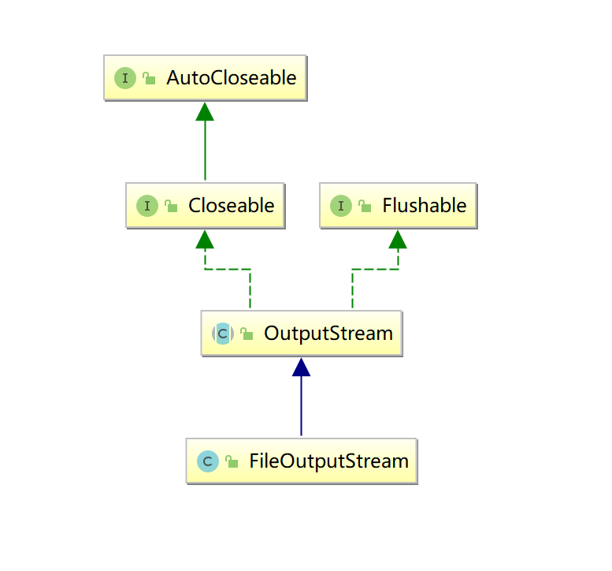
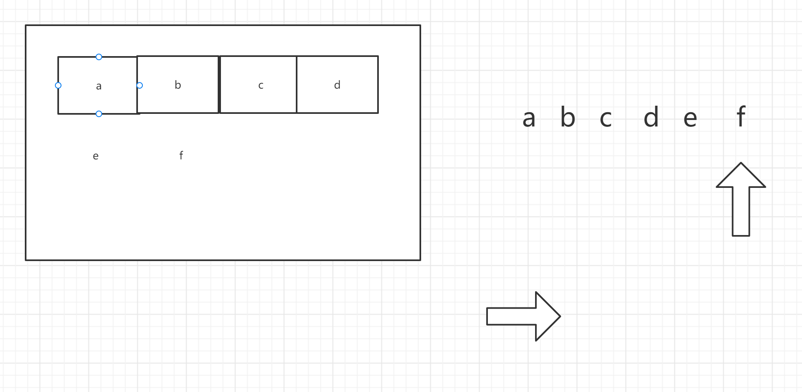
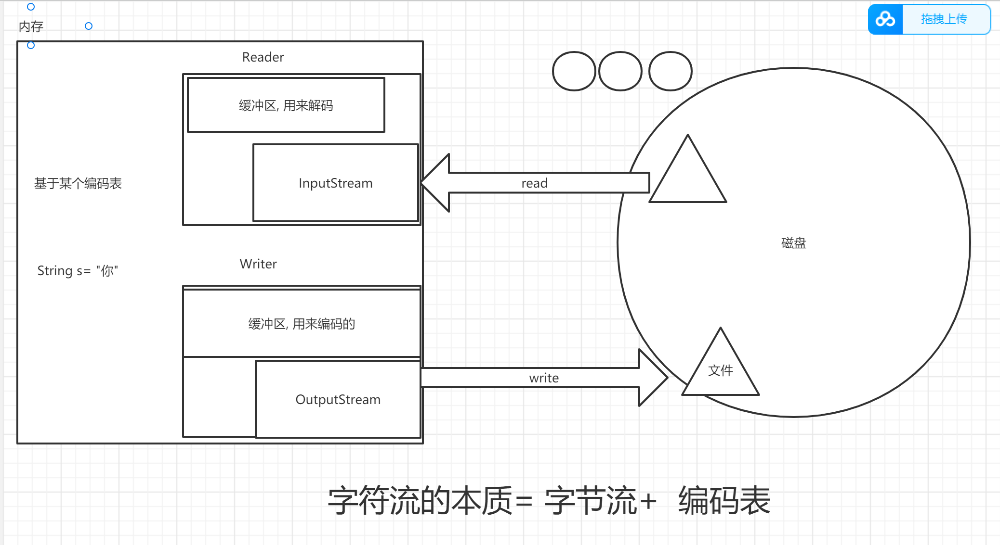
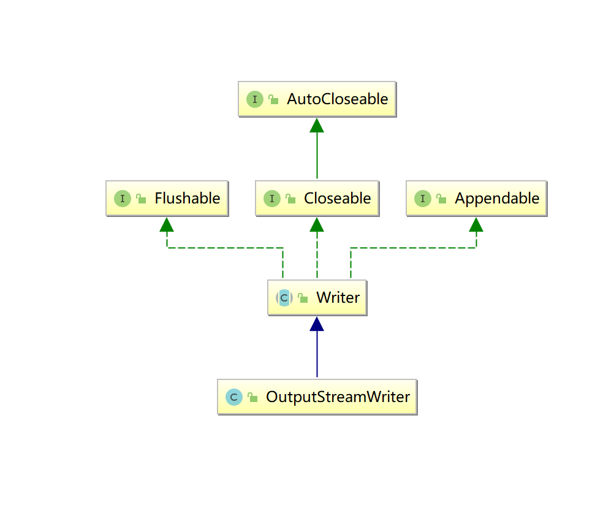
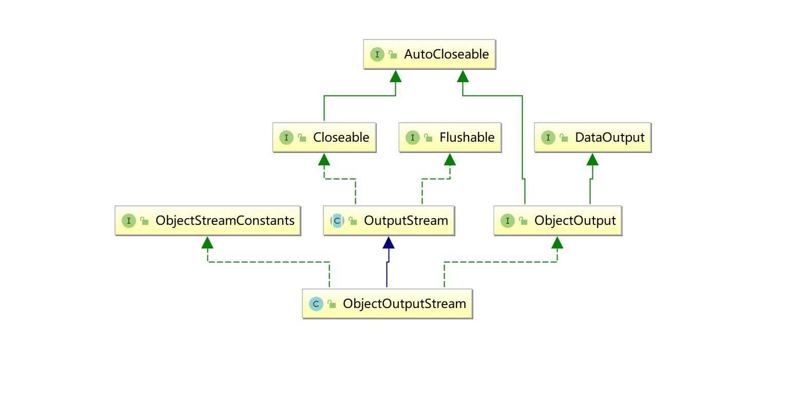

学习目标:

- 掌握IO体系及分类
- 熟练掌握字节流
- 熟悉字符流
- 熟悉其他流

# IO概述

## 什么是IO?

input : 输入   读

output: 输出  写

## 为什么有IO?

 在操作系统中，一切需要永久保存的数据都以文件的形式 存储。需要长久保存的文件数据，存储在外部设备。
但是需要读入内存才能显示这些数据
同时，内存的大小有限，因此常常需要在内存和外设之间交换数据，即I/O

## java中如何实现IO功能

Java流模型


## IO的分类

**按流向分(以内存为参照物)**

- 输出流: 内存---> 磁盘
- 输入流: 磁盘---> 内存

**按照数据类型分**

- 字节流: 逻辑单位是字节,(1B = 8bit  0000 0000) 
- 字符流: 逻辑单位是字符(理解为一种文化符号,abc , "你", "の")


## 4个抽象基类

字节输出流: OutputStream

字节输入流: InputStream

字符输出流: Writer

字符输入流: Reader

由这4个抽象基类派生的子类都是以其父类名作为后缀的

如：InputStream的子类FileInputStream。
如：Reader的子类FileReader

## 什么时候用什么流?

一般来讲, 纯文本文件用字符流  .txt .java .cpp

其他情况用字节流(字节流是万能的)  .word  .ppt  .mp4  .mp3 .jpg . png  .exe

# 字节流

## 字节输出流

### 抽象基类OutputStream

此抽象类是表示输出字节流的所有类的超类 

**继承关系**


**成员方法**

| void           | close()        关闭此输出流并释放与此流有关的所有系统资源。  |
| -------------- | ------------------------------------------------------------ |
| void           | flush()        刷新此输出流并强制写出所有缓冲的输出字节。    |
| void           | write(byte[] b)        将 b.length 个字节从指定的 byte 数组写入此输出流。 |
| void           | write(byte[] b,  int off, int len)       将指定 byte 数组中从偏移量 off 开始的  len 个字节写入此输出流。 |
| abstract  void | write(int b)        将指定的字节写入此输出流。write 的常规协定是：向输出流写入一个字节。要写入的字节是参数 b 的八个低位。b 的 24 个高位将被忽略。 |

### 具体子类

#### FileOutputStream文件字节输出流

用于将数据写入 File 

**继承关系**



**构造方法**

| FileOutputStream(File file)        创建一个向指定 File 对象表示的文件中写入数据的文件输出流。 |
| ------------------------------------------------------------ |
| FileOutputStream(File file,  boolean append)       创建一个向指定 File  对象表示的文件中写入数据的文件输出流。 |
| FileOutputStream(String fileName)        创建一个向具有指定名称的文件中写入数据的输出文件流。 |
| FileOutputStream(String name,  boolean append)       创建一个向具有指定 name 的文件中写入数据的输出文件流 append - 如果为 true，则将字节写入文件末尾处，而不是写入文件开始处 |

**成员方法**

| void           | write(byte[] b)        将 b.length 个字节从指定的 byte 数组写入此输出流。 |
| -------------- | ------------------------------------------------------------ |
| void           | write(byte[] b,  int off, int len)       将指定 byte 数组中从偏移量 off 开始的  len 个字节写入此输出流。 |
| abstract  void | write(int b)        将指定的字节写入此输出流。write 的常规协定是：向输出流写入一个字节。要写入的字节是参数 b 的八个低位。b 的 24 个高位将被忽略。 |

Demo

```java 
package _16io01.com.cskaoyan.bytestream._01fileoutputstream;

import java.io.File;
import java.io.FileNotFoundException;
import java.io.FileOutputStream;
import java.io.IOException;

/**
 * @description:
 * @author: 景天
 * @date: 2022/10/15 9:13
 **/
/*
写数据的步骤
1.创建输出流对象
2.write
3.释放资源 close
 */
public class Demo {
    public static void main(String[] args) throws IOException {
        //1.创建输出流对象
        //FileOutputStream out = new FileOutputStream(new File("D:\\workspace2\\java46th\\a.txt"));
        FileOutputStream out = new FileOutputStream("b.txt");

        //2.write
        // write(int b) 写单个字节
        //out.write(97);


        // write(byte[] b) 批量写
        String s = "abc";
        byte[] bytes = s.getBytes();
        out.write(bytes);

        // write(byte [] b , int off , int len) 写字节数组的部分
        out.write(bytes, 1, 2);

        //3.释放资源 close
        out.close();
    }
}

```


#### 注意事项

- 当我们创建一个输出流对象的时候,发生了什么?

  - jvm向操作系统中看这个文件是否存在
  - 如果文件不存在, 帮我们创建
  - 文件已经存在, 覆盖重新开始写

- 如何实现文件追加功能?

  - 借助于带append参数的构造方法

  - ```Java
    package _16io01.com.cskaoyan.bytestream._01fileoutputstream;
    
    import java.io.FileOutputStream;
    import java.io.IOException;
    
    /**
     * @description:
     * @author: 景天
     * @date: 2022/10/15 10:55
     **/
    /*
    实现文件追加功能
     */
    public class Demo2 {
        public static void main(String[] args) throws IOException {
            // 使用带append的构造方法
            // 创建输出流对象
            FileOutputStream out = new FileOutputStream("a.txt", true);
            // write
            out.write(100);
            // close
            out.close();
        }
    }
    
    ```

- 如何实现换行功能

  - ```java
    package _16io01.com.cskaoyan.bytestream._01fileoutputstream;
    
    import java.io.FileOutputStream;
    import java.io.IOException;
    
    /**
     * @description:
     * @author: 景天
     * @date: 2022/10/15 10:57
     **/
    /*
    实现换行功能
     */
    public class Demo3 {
        public static void main(String[] args) throws IOException {
            // 创建输出流对象
            FileOutputStream out = new FileOutputStream("a.txt");
            out.write("abcd".getBytes());
            // write 写换行符
            // \r\n
            out.write("\r\n".getBytes());
            out.write(97);
    
            out.write("\r".getBytes());
            out.write(97);
    
            out.write("\n".getBytes());
            out.write(97);
            
            // 使用系统默认换行符
            out.write(System.lineSeparator().getBytes());
            out.write(97);
    
            // close
            out.close();
        }
    }
    
    ```

- 如何异常处理

  - try-catch-finally

    - ```java
      package _16io01.com.cskaoyan.bytestream._01fileoutputstream;
      
      import java.io.FileNotFoundException;
      import java.io.FileOutputStream;
      import java.io.IOException;
      import java.io.OutputStream;
      
      /**
       * @description:
       * @author: 景天
       * @date: 2022/10/15 11:04
       **/
      /*
      try-catch
       */
      public class Demo4 {
          public static void main(String[] args) {
              // 创建输出流对象
              FileOutputStream out = null;
              try {
                  // xxxxxx
                  // xxxx
                  out = new FileOutputStream("a.txt");
                  // write
                  out.write("aaaa".getBytes());
              } catch (FileNotFoundException e) {
                  e.printStackTrace();
              } catch (IOException e) {
                  e.printStackTrace();
              }finally {
                  // close
                  try {
                      if (out != null) {
                          out.close();
                      }
                  } catch (IOException e) {
                      e.printStackTrace();
                  }
              }
      
          }
      }
      
      ```

      

  - try-with-resources

    - ```java
      语法
      try(资源,只要实现了AutoCloseable接口的类){
       //可能出现异常的代码
       // 当出了try代码块的时候 close方法会自动执行 资源会被自动释放
      }catch(){
      	
      }
      ```

    - ```java
      package _16io01.com.cskaoyan.bytestream._01fileoutputstream;
      
      import java.io.FileNotFoundException;
      import java.io.FileOutputStream;
      import java.io.IOException;
      
      /**
       * @description:
       * @author: 景天
       * @date: 2022/10/15 11:13
       **/
      /*
      try-with-resources
       */
      public class Demo5 {
          public static void main(String[] args) {
              try(FileOutputStream out = new FileOutputStream("a.txt")) {
                  // write数据
                  out.write("abc".getBytes());
              } catch (FileNotFoundException e) {
                  e.printStackTrace();
              } catch (IOException e) {
                  e.printStackTrace();
              }
          }
      }
      
      ```

    - 验证自动执行

    - ```java
      package _16io01.com.cskaoyan.bytestream._01fileoutputstream;
      
      /**
       * @description:
       * @author: 景天
       * @date: 2022/10/15 11:15
       **/
      /*
      验证close方法自动执行
       */
      public class Demo6 {
          public static void main(String[] args) {
              try (A a = new A()){
                  // 调用func 不调用close
                  a.func();
              } catch (Exception e) {
                  e.printStackTrace();
              }
          }
      }
      
      class A implements AutoCloseable{
      
          @Override
          public void close() throws Exception {
              System.out.println("close执行了");
          }
      
          public void func(){
              System.out.println("func方法执行了");
          }
      }
      ```

- 为什么要close?

  - jvm使用了不属于jvm的资源, 不能通过GC回收, 只能通过close显式的释放资源.


#### BufferedOutputStream缓冲字节输出流

该类实现缓冲的输出流。通过设置这种输出流，应用程序就可以将各个字节写入底层输出流中，而不必针对每次字节写入调用底层系统。 

**继承关系**


**构造方法**

| BufferedOutputStream(OutputStream out)        创建一个新的缓冲输出流，以将数据写入指定的底层输出流。默认缓冲区大小是8KB |
| ------------------------------------------------------------ |
| BufferedOutputStream(OutputStream out,  int size)       创建一个新的缓冲输出流，以将具有指定缓冲区大小的数据写入指定的底层输出流。 指定缓冲区size大小 |

**成员方法**

3个write方法

write(int b)

write(byte[] b)

write(byte[] b, int off, int len)

Demo

```java 
package _17io02.com.cskaoyan.bytestream._03buffer;

import java.io.BufferedOutputStream;
import java.io.File;
import java.io.FileOutputStream;
import java.io.IOException;

/**
 * @description:
 * @author: 景天
 * @date: 2022/10/17 11:02
 **/
/*
使用缓冲输出流
 */
public class Demo {
    public static void main(String[] args) throws IOException {
        // 创建输出流对象
        //FileOutputStream fileOutputStream = new FileOutputStream("a.txt");
        //BufferedOutputStream out = new BufferedOutputStream(fileOutputStream);

        BufferedOutputStream out =
                new BufferedOutputStream(new FileOutputStream("a.txt"));

        // write
        // 写单个字节
        out.write(97);
        out.write(98);

        out.write("yyds".getBytes());
        
        // flush
        out.flush();

        // close
        out.close();
    }
}

```


注意：

- 使用所有带缓冲区的输出流, 记得flush操作

- 执行close方法会自动执行flush

  - 

- 缓冲区满了会自动刷新

  - ```java
    
    public class Demo2 {
        public static void main(String[] args) throws IOException {
            // 使用指定缓冲区
            BufferedOutputStream out =
                    new BufferedOutputStream(new FileOutputStream("a.txt"), 4);
            // write
            out.write("abcdef".getBytes());
    
            // flush
    
            // close
        }
    }
    ```


## 字节输入流

### 抽象基类InputStream

此抽象类是表示字节输入流的所有类的超类。

**继承关系**


**成员方法**

| abstract  int | read()        从输入流中读取数据的下一个字节。返回 0 到 255 范围内的 int 字节值。如果因为已经到达流末尾而没有可用的字节，则返回值 -1。在输入数据可用、检测到流末尾或者抛出异常前，此方法一直阻塞。返回值代表了读取到的字节值  readData |
| ------------- | ------------------------------------------------------------ |
| int           | read(byte[] b)        从输入流中读取一定数量的字节，并将其存储在缓冲区数组 b 中。读入缓冲区的总字节数；如果因为已经到达流末尾而不再有数据可用，则返回 -1。返回值表示读取的字节的个数 readCount |
| int           | read(byte[] b,  int off, int len)       将输入流中最多 len 个数据字节读入 byte 数组。 |


### 具体子类

#### FileInputStream文件字节输入流

`FileInputStream` 从文件系统中的某个文件中获得输入字节

**继承关系**


**构造方法**

| FileInputStream(File file)        通过打开一个到实际文件的连接来创建一个 FileInputStream，该文件通过文件系统中的  File 对象 file 指定。 |
| ------------------------------------------------------------ |
| FileInputStream(String fileName)        通过打开一个到实际文件的连接来创建一个 FileInputStream，该文件通过文件系统中的路径名  name 指定。 |

**成员方法**

| abstract  int | read()        从输入流中读取数据的下一个字节。返回 0 到 255 范围内的 int 字节值。如果因为已经到达流末尾而没有可用的字节，则返回值 -1。在输入数据可用、检测到流末尾或者抛出异常前，此方法一直阻塞。返回值代表了读取到的字节值  readData |
| ------------- | ------------------------------------------------------------ |
| int           | read(byte[] b)        从输入流中读取一定数量的字节，并将其存储在缓冲区数组 b 中。读入缓冲区的总字节数；如果因为已经到达流末尾而不再有数据可用，则返回 -1。返回值表示读取的字节的个数 readCount |
| int           | read(byte[] b,  int off, int len)       将输入流中最多 len 个数据字节读入 byte 数组。 |

Demo 

```java 
package _16io01.com.cskaoyan.bytestream._02fileinputstream;

import java.io.FileInputStream;
import java.io.IOException;

/**
 * @description:
 * @author: 景天
 * @date: 2022/10/15 11:33
 **/
/*
读取数据的步骤
1.创建输入流对象
2.read
3.close释放资源
 */
public class Demo {
    public static void main(String[] args) throws IOException {
        //1.创建输入流对象
        FileInputStream in = new FileInputStream("a.txt");
        //2.read
        // read() 读取单字节
        // readData 表示读取的字节值
        // readSingle(in);

        // read(byte[])
        // readMulti(in);

        
        // read(byte[],int off,int len)
        //3.close释放资源
        in.close();
    }

    private static void readMulti(FileInputStream in) throws IOException {
        byte[] bytes = new byte[1024];
        // readCount 表示读取到的字节的个数
        int readCount = in.read(bytes);
        System.out.println("readCount = " + readCount);
        String s = new String(bytes);
        System.out.println(s);
    }

    private static void readSingle(FileInputStream in) throws IOException {
        int readData = in.read();
        System.out.println(((char) readData));

        int readData2 = in.read();
        System.out.println(((char) readData2));

        int readData3 = in.read();
        System.out.println(((char) readData3));

        int readData4 = in.read();
        System.out.println(readData4);
    }
}

```


```java 
package _16io01.com.cskaoyan.bytestream._02fileinputstream;


import java.io.FileInputStream;
import java.io.IOException;

/**
 * @description:
 * @author: 景天
 * @date: 2022/10/15 11:43
 **/

public class Demo2 {
    public static void main(String[] args) throws IOException {
        // 创建输入流对象
        FileInputStream in = new FileInputStream("a.txt");

        // read
        // read(byte[])
        byte[] bytes = new byte[4];
        int readCount = in.read(bytes);
        System.out.println(new String(bytes));

        int readCount2 = in.read(bytes);
        System.out.println(new String(bytes,0,readCount2));

        // close
        in.close();
    }
}

```





**循环读取**

```java
package _17io02.com.cskaoyan.bytestream._01readwhile;

import java.io.FileInputStream;
import java.io.IOException;

/**
 * @description:
 * @author: 景天
 * @date: 2022/10/17 9:43
 **/

/*
循环读取数据
 */
public class Demo {
    public static void main(String[] args) throws IOException {
        // 创建输入流对象
        FileInputStream in = new FileInputStream("a.txt");

        // 循环
        // readWhile1(in);

        // 新的方式
        // 单字节读取
        // readWhile2(in);

        // 字节数组方式
        int readCount;
        byte[] bytes = new byte[1024];
        while ((readCount = in.read(bytes)) != -1) {
            System.out.println(new String(bytes,0,readCount));
        }


        // close
        in.close();
    }

    private static void readWhile2(FileInputStream in) throws IOException {
        int readData;
        // == -1 就结束循环 意味文件里读取完了
        while ((readData = in.read()) != -1) {
            System.out.println(((char) readData));

        }
    }

    private static void readWhile1(FileInputStream in) throws IOException {
        while (true) {
            // read
            int readData = in.read();
            if (readData == -1) {
                break;
            }
            System.out.println(((char) readData));

        }
    }
}
```


#### BufferedInputStream缓冲字节输入流

**继承关系**


**构造方法**

| BufferedInputStream(InputStream in)        创建一个 BufferedInputStream 并保存其参数，即输入流  in，以便将来使用。默认缓冲区8KB |
| ------------------------------------------------------------ |
| BufferedInputStream(InputStream in,  int size)       创建具有指定缓冲区大小的 BufferedInputStream  并保存其参数，即输入流 in，以便将来使用。 使用指定的缓冲区 |

**成员方法**

3个read

read() 读取单个字节

read(byte [] b) 读取数据填充到数组

read(byte [] b, int off , int len) 读取数据填充到数组

```java
package _17io02.com.cskaoyan.bytestream._03buffer;

import java.io.BufferedInputStream;
import java.io.FileInputStream;
import java.io.IOException;

/**
 * @description:
 * @author: 景天
 * @date: 2022/10/17 11:18
 **/
/*
使用缓冲的输入流
 */
public class Demo3 {
    public static void main(String[] args) throws IOException {
        // 创建输入流对象
        BufferedInputStream in =
                new BufferedInputStream(new FileInputStream("a.txt"));

        // read
        // 单个读取
        int readData = in.read();
        System.out.println(readData);

        // 批量
        byte[] bytes = new byte[1024];
        int readCount = in.read(bytes);
        System.out.println(new String(bytes,0,readCount));

        // close
        in.close();
    }
}

```


## 文件复制功能

思路:

- 读取源文件,  把数据读取到内存里
- 把内存的数据写到新文件

主要逻辑


**使用字节流复制**

文本文件:  正常复制

图片文件: 正常复制

视频文件: 正常复制


**使用字符流复制**

文本文件:  正常复制

图片文件: 复制出错

视频文件: 复制出错

**单字节复制还是字节数组方式效率高?**

- 字节数组批量的方式效率高

**为什么?**

- 批量的方式会减少跟操作系统的交互

举例:

我在JD 买了5个快递

单字节: 快递小哥1次送一个

字节数组方式: 东哥说了  大家都是兄弟 配车   快递装车里


# 字符流

## 为什么有字符流?

- 使用字节流读取英文数字
  - 没有问题
- 使用字节流读取中文
  - 可能有问题

## 一个字符是如何存在计算机中的

基于某个编码表. 每个字符对应这一个整数值(编码值), 计算机存的就是这个整数值

| 字符 | 编码值(整数值)           |
| ---- | ------------------------ |
| a    | 97 ---> 二级制  01100001 |
| 你   | 20320 --->二进制         |


## 编码表

ASCII：美国标准信息交换码。
用一个字节的7位可以表示。0000 0000 - 0111 1111
ISO8859-1：拉丁码表。欧洲码表
用一个字节的8位表示。  0000 0000 - 1111 1111

GB2312：中国的中文编码表。
GBK：中国的中文编码表升级，融合了更多的中文文字符号。
GB18030：GBK的取代版本
BIG-5码 ：通行于台湾、香港地区的一个繁体字编码方案，俗称“大五码”。

Unicode：国际标准码，融合了多种文字。

UTF-8：可变长度来表示一个字符。
UTF-8不同，它定义了一种“区间规则”，这种规则可以和ASCII编码保持最大程度的兼容：

它将Unicode编码为00000000-0000007F的字符，用单个字节来表示  0111  1111  =  7F
它将Unicode编码为00000080-000007FF的字符用两个字节表示 
它将Unicode编码为00000800-0000FFFF的字符用3字节表示 

1字节 0xxxxxxx 
2字节 110xxxxx 10xxxxxx 
3字节 1110xxxx 10xxxxxx 10xxxxxx 

utf-16:

jvm使用的编码表，用2个字节来编解码

char : 2 字节 

**工作中常用的**

- Ascii     1个字节的低7位
- ISO8859-1   1个字节
- GBK      2个字节表示一个中文字符
- UTF-8    3个字节表示一个中文字符


## 编解码

**编码**

- 把一字符串数据转为二进制数据存到计算机的过程(把人看懂的东西-----> 计算机看懂的东西)

**解码**

- 编码的逆过程(把计算机看懂的东西 ---- > 人看懂的东西)


举例:

类似于摩斯密码

你 

中文编码表 0x0001

日文编码表 0x0001  の

**默认的编码表**

- idea: Utf-8
- Win: GBK  (ANSI 默认的)


## java中的编解码

```java
package _17io02.com.cskaoyan.charstream.com.cskoyan._02encode;

import java.io.UnsupportedEncodingException;
import java.util.Arrays;

/**
 * @description:
 * @author: 景天
 * @date: 2022/10/17 14:58
 **/
/*
java中的编解码
 */
public class Demo2 {
    public static void main(String[] args) throws UnsupportedEncodingException {
        // 编码过程
        // 人看懂---->计算机看懂的
        String s = "你好";
        // byte[] getBytes()
        // 使用平台的默认字符集将此 String 编码为 byte 序列，
        // 并将结果存储到一个新的 byte 数组中
        //byte[] bytes = s.getBytes();
        //System.out.println(Arrays.toString(bytes));
        // [-28, -67, -96, -27, -91, -67]

        // byte[] getBytes(String charsetName)
        // 使用指定的字符集将此 String 编码为 byte 序列，并将结果存储到一个新的 byte 数组中。
        byte[] bytes = s.getBytes("GBK");
        System.out.println(Arrays.toString(bytes));
        // [-60, -29, -70, -61]


        // 解码过程
        // 计算机看懂的----> 人看懂的
        // String(byte[] bytes)
        // 通过使用平台的默认字符集解码指定的 byte 数组，构造一个新的 String。
        //String s1 = new String(bytes);
        //System.out.println(s1);

        // String(byte[] bytes, String charsetName)
        // 通过使用指定的 charset 解码指定的 byte 数组，构造一个新的 String。
        String s2 = new String(bytes, "gbk");
        System.out.println(s2);

    }
}

```


**乱码问题**

- 产生的原因: 编码解码不一致
- 解决: 使其一致


## 字符流的本质



## 字符输出流

### 抽象基类Writer

写入字符流的抽象类

**继承关系**


**成员方法**

| void           | write(char[] cbuf)        写入字符数组。                     |
| -------------- | ------------------------------------------------------------ |
| abstract  void | write(char[] cbuf,  int off, int len)       写入字符数组的某一部分。 |
| void           | write(int c)        写入单个字符。                           |
| void           | write(String str)        写入字符串。                        |
| void           | write(String str,  int off, int len)       写入字符串的某一部分 |

### 具体子类

#### OutputStreamWriter转换流

OutputStreamWriter 是字符流通向字节流的桥梁：可使用指定的 [`charset`](../../java/nio/charset/Charset.html)  将要写入流中的字符编码成字节。它使用的字符集可以由名称指定或显式给定，否则将接受平台默认的字符集。

**继承关系**



**构造方法**

| OutputStreamWriter(OutputStream out)        创建使用默认字符编码的 OutputStreamWriter。 |
| ------------------------------------------------------------ |
| OutputStreamWriter(OutputStream out,  String charsetName)        创建使用指定字符集的 OutputStreamWriter。 |

**成员方法**

5个write

3+2

3个跟字符相关的

2个跟字符串相关的

Demo

```java

package _17io02.com.cskaoyan.charstream.com.cskoyan._03transfer;

import java.io.*;

/**
 * @description:
 * @author: 景天
 * @date: 2022/10/17 15:52
 **/
/*
使用转换输出流写数据
 */
public class Demo {
    public static void main(String[] args) throws IOException {
        // 创建输出流对象
        //new OutputStreamWriter(new BufferedOutputStream(new FileOutputStream(new File("a.txt"))));

        OutputStreamWriter out =
                new OutputStreamWriter(new FileOutputStream("a.txt"));

        // write
        // write(int c) 写单个字符
        out.write(97);

        out.write(System.lineSeparator());
        // write(char[] c) 写字符数组
        String s = "宝,今天我输液了,什么夜,想你的夜";
        char[] chars = s.toCharArray();
        out.write(chars);

        out.write(System.lineSeparator());

        // write(char[] c, int off ,int len)
        out.write(chars, 0, 3);

        out.write(System.lineSeparator());
        // write(String s)
        out.write(s);

        out.write(System.lineSeparator());
        // write(String s, int off ,int len)
        out.write(s,1,4);


        // flush
        out.flush();

        // close
        out.close();
    }
}

```


#### FileWriter简化流

用来写入字符文件的便捷类

**继承关系**


**构造方法**

| FileWriter(File file)        根据给定的 File 对象构造一个 FileWriter 对象。 |
| ------------------------------------------------------------ |
| FileWriter(File file,  boolean append)       根据给定的 File 对象构造一个 FileWriter 对象。 |
| FileWriter(String fileName)        根据给定的文件名构造一个 FileWriter 对象。 |
| FileWriter(String fileName,  boolean append)       根据给定的文件名以及指示是否附加写入数据的 boolean 值来构造  FileWriter 对象。 |


**成员方法**

5个write

3个跟字符相关的

2个跟字符串相关的

```java
package _17io02.com.cskaoyan.charstream.com.cskoyan._05simple;

import java.io.FileWriter;
import java.io.IOException;

/**
 * @description:
 * @author: 景天
 * @date: 2022/10/17 16:32
 **/
/*
使用简化流写数据
 */
public class Demo2 {
    public static void main(String[] args) throws IOException {
        // 创建输出流对象
        FileWriter fileWriter = new FileWriter("a.txt");
        // write
        fileWriter.write("宝,我今天拉便便了,什么便,想你的一遍又一遍");
        // flush
        fileWriter.flush();
        // close
        fileWriter.close();
    }
}

```


#### BufferedWriter缓冲流

将文本写入字符输出流，缓冲各个字符，从而提供单个字符、数组和字符串的高效写入。 

可以指定缓冲区的大小，或者接受默认的大小。在大多数情况下，默认值就足够大了

**继承关系**


**构造方法**

| BufferedWriter(Writer out)        创建一个使用默认大小输出缓冲区的缓冲字符输出流。默认缓冲区大小是16KB |
| ------------------------------------------------------------ |
| BufferedWriter(Writer out,  int sz)       创建一个使用给定大小输出缓冲区的新缓冲字符输出流。缓冲区大小size |

**成员方法**

5 + 1

5个常规的write

1个独有的方法

newLine()        写入一个行分隔符。

Demo

```java
package _17io02.com.cskaoyan.charstream.com.cskoyan._06buffer;

import java.io.BufferedWriter;
import java.io.FileOutputStream;
import java.io.FileWriter;
import java.io.IOException;

/**
 * @description:
 * @author: 景天
 * @date: 2022/10/17 17:10
 **/
/*
使用缓冲输出流写数据
 */
public class Demo {
    public static void main(String[] args) throws IOException {
        // 创建输出流对象
        BufferedWriter bw = new BufferedWriter(new FileWriter("a.txt"));
        // write
        bw.write("大郎,来喝药!");

        // 独有的方法 newLine
        bw.newLine();
        bw.write("大郎,来喝药!");

        // flush
        bw.flush();

        // close
        bw.close();
    }
}

```


## 字符输入流

### 抽象基类Reader

用于读取字符流的抽象类

**成员方法**

| int           | read()        读取单个字符。作为整数读取的字符，范围在 0 到 65535 之间 (0x00-0xffff)，如果已到达流的末尾，则返回 -1   用readData 读取到的字符值 |
| ------------- | ------------------------------------------------------------ |
| int           | read(char[] cbuf)        将字符读入数组。 读取的字符数，如果已到达流的末尾，则返回 -1 用readCount表示 读取到的字符的个数 |
| abstract  int | read(char[] cbuf,  int off, int len)       将字符读入数组的某一部分。 |

### 具体子类

#### InputStreamReader转换流

InputStreamReader 是字节流通向字符流的桥梁：它使用指定的 [`charset`](../../java/nio/charset/Charset.html)  读取字节并将其解码为字符。它使用的字符集可以由名称指定或显式给定，或者可以接受平台默认的字符集。

**构造方法**

| InputStreamReader(InputStream in)        创建一个使用默认字符集的 InputStreamReader。 |
| ------------------------------------------------------------ |
| InputStreamReader(InputStream in, String charsetName)        创建使用指定字符集的 InputStreamReader。 |

**成员方法**

3个read方法

read()

read(char[] c)

read(char[] c ,int off, int len)

Demo

```java 
package _17io02.com.cskaoyan.charstream.com.cskoyan._03transfer;

import java.io.FileInputStream;
import java.io.IOException;
import java.io.InputStreamReader;

/**
 * @description:
 * @author: 景天
 * @date: 2022/10/17 16:06
 **/
/*
使用转换流读取数据
 */
public class Demo2 {
    public static void main(String[] args) throws IOException {
        // 创建输入流对象
        InputStreamReader in = new InputStreamReader(new FileInputStream("a.txt"));
        // read
        // read() 读取单个字符
        int readData = in.read();
        System.out.println(((char) readData));

        // read(char[] c) 批量读取
        char[] chars = new char[1024];
        int readCount = in.read(chars);
        String s = new String(chars, 0, readCount);
        System.out.println(s);

        // close
        in.close();
    }
}

```


#### FileReader简化流

**继承关系**


**构造方法**

| FileReader(File file)        在给定从中读取数据的 File 的情况下创建一个新 FileReader。 |
| ------------------------------------------------------------ |
| FileReader(String fileName)        在给定从中读取数据的文件名的情况下创建一个新 FileReader。 |

**成员方法**

3个read

Demo

```java
package _17io02.com.cskaoyan.charstream.com.cskoyan._05simple;

import java.io.FileReader;
import java.io.IOException;

/**
 * @description:
 * @author: 景天
 * @date: 2022/10/17 16:37
 **/
/*
简化流读取数据
 */
public class Demo3 {
    public static void main(String[] args) throws IOException {
        // 创建输入流对象
        FileReader reader = new FileReader("D:\\b.txt");
        // read
        char[] chars = new char[1024];
        int readCount = reader.read(chars);
        System.out.println(new String(chars,0,readCount));
        // close
        reader.close();
    }
}

```


**转换流VS简化流**

- 使用角度, 简化流简单, 转换流麻烦
- 继承关系, 转换流是简化流的父类
- 核心区别, 简化流不能指定字符集(使用默认的字符集), 转化流可以指定的字符集

#### BufferedReader缓冲流

从字符输入流中读取文本，缓冲各个字符，从而实现字符、数组和行的高效读取。 

可以指定缓冲区的大小，或者可使用默认的大小。大多数情况下，默认值就足够大了

**继承关系**


**构造方法**

| BufferedReader(Reader in)        创建一个使用默认大小输入缓冲区的缓冲字符输入流。 |
| ------------------------------------------------------------ |
| BufferedReader(Reader in,  int sz)       创建一个使用指定大小输入缓冲区的缓冲字符输入流。 |

**成员方法**

3+1

3个常规read

1个独有的方法

| String | readLine()        读取一个文本行。如果已到达流末尾，则返回 <font color=red>null</font> |
| ------ | ------------------------------------------------------------ |
|        |                                                              |

Demo

```java 
package _17io02.com.cskaoyan.charstream.com.cskoyan._06buffer;

import java.io.BufferedReader;
import java.io.FileInputStream;
import java.io.IOException;
import java.io.InputStreamReader;

/**
 * @description:
 * @author: 景天
 * @date: 2022/10/17 17:17
 **/

/*
使用缓冲的输入流读取数据
 */
public class Demo2 {
    public static void main(String[] args) throws IOException {
        // 创建输入流对象
        BufferedReader br =
                new BufferedReader(new InputStreamReader(new FileInputStream("a.txt")));
        // 常规read
        //char[] chars = new char[1024];
        //int readCount = br.read(chars);
        //System.out.println(new String(chars, 0, readCount));

        // 自己独有的方法 readLine()
        String s = br.readLine();
        System.out.println(s);
        String s1 = br.readLine();
        System.out.println(s1);
        String s2 = br.readLine();
        System.out.println(s2);
        // close
        br.close();
    }
}


package _17io02.com.cskaoyan.charstream.com.cskoyan._06buffer;

import java.io.BufferedReader;
import java.io.FileInputStream;
import java.io.IOException;
import java.io.InputStreamReader;

/**
 * @description:
 * @author: 景天
 * @date: 2022/10/17 17:17
 **/

/*
使用缓冲的输入流循环读取数据 readline()
 */
public class Demo3 {
    public static void main(String[] args) throws IOException {
        // 创建输入流对象
        BufferedReader br =
                new BufferedReader(new InputStreamReader(new FileInputStream("a.txt")));

        // 自己独有的方法 readLine()
        String line;
        while ((line = br.readLine()) != null) {
            System.out.println(line);
        }
        // close
        br.close();
    }
}

```


# 其他流

## 数据流

需求: 用字节流向文件中写个整数1000   小数3.14

- 做不到

### DataOutputStream数据输出流

数据输出流允许应用程序以适当方式将基本 Java 数据类型写入输出流中。然后，应用程序可以使用数据输入流将数据读入。 

**构造方法**

DataOutputStream(OutputStream out)        创建一个新的数据输出流，将数据写入指定基础输出流。

**成员方法**

每种数据类型都有1个对应的write方法

举例

int   ---->  writeInt(int a)

double ---->  writeDouble(double d)

....


### DataInputStream数据输入流

数据输入流允许应用程序以与机器无关方式从底层输入流中读取基本 Java 数据类型

**构造方法**

DataInputStream(InputStream in)        使用指定的底层 InputStream 创建一个 DataInputStream。

**成员方法**

每种数据类型都有1个对应的read方法

举例

int   ---->  readInt()

double ---->  readDouble()

....


```java 
package _18io03.com.cskaoyan._01data;

import java.io.*;

/**
 * @description:
 * @author: 景天
 * @date: 2022/10/18 10:08
 **/
/*
数据流的使用
 */
public class Demo2 {
    public static void main(String[] args) throws IOException {
        writeData();
        readData();

    }

    private static void readData() throws IOException {
        // 创建输入流对象
        DataInputStream in = new DataInputStream(new FileInputStream("a.txt"));
        // read
        int i = in.readInt();
        System.out.println(i);

        double v = in.readDouble();
        System.out.println(v);
        // close
        in.close();
    }

    private static void writeData() throws IOException {
        // 创建输出流对象
        DataOutputStream out = new DataOutputStream(new FileOutputStream("a.txt"));
        // write
        // 写1000
        out.writeInt(1000);
        // 写3.14
        out.writeDouble(3.14);
        //close
        out.close();
    }
}

```


```java
package _18io03.com.cskaoyan._01data;

import java.io.*;

/**
 * @description:
 * @author: 景天
 * @date: 2022/10/18 10:24
 **/

public class Demo3 {
    public static void main(String[] args) throws IOException {
        write();
        read();
    }

    private static void read() throws FileNotFoundException, IOException {
        DataInputStream dis = new DataInputStream(
                new FileInputStream("dos.txt"));
        byte b = dis.readByte();
        System.out.println(b);
        short s = dis.readShort();
        System.out.println(s);
        int i = dis.readInt();
        System.out.println(i);
        long l = dis.readLong();
        System.out.println(l);
        float f = dis.readFloat();
        System.out.println(f);
        double d = dis.readDouble();
        System.out.println(d);
        char ch = dis.readChar();
        System.out.println(ch);
        boolean bb = dis.readBoolean();
        System.out.println(bb);
        dis.close();
    }

    private static void write() throws IOException {
        DataOutputStream dos = new DataOutputStream(new FileOutputStream(
                "dos.txt"));
        dos.writeByte(1);
        dos.writeShort(20);
        dos.writeInt(300);
        dos.writeLong(4000);
        dos.writeFloat(12.34f);
        dos.writeDouble(12.56);
        dos.writeChar('a');
        dos.writeBoolean(true);
        dos.close();
    }

}

```


**注意**

- 写的顺序是什么, 读取的时候要按照相同的顺序
- 


## 打印流

核心思想: 把不同的数据类型--->String 

案例:

定义一个类Printer

定义成员变量OutputStream

定义5个方法

写int的方法  void printInt(int a)

写int并且换行的方法 void printIntLn(int a)

写double的方法  void printDouble(double a)

写double并且换行的方法 void printDoubleLn(double a)

写一个close方法  void  close()

```java
package _18io03.com.cskaoyan._02print;

import java.io.FileOutputStream;
import java.io.IOException;
import java.io.OutputStream;

/**
 * @description:
 * @author: 景天
 * @date: 2022/10/18 10:54
 **/
/*
案例:

定义一个类Printer

定义成员变量OutputStream

定义5个方法

写int的方法  void printInt(int a)

写int并且换行的方法 void printIntLn(int a)

写double的方法  void printDouble(double a)

写double并且换行的方法 void printDoubleLn(double a)

写一个close方法  void  close()
 */
public class Demo {
    public static void main(String[] args) throws IOException{
        // 创建Printer对象 给Out赋值
        Printer printer = new Printer(new FileOutputStream("a.txt"));
        // 向文件中写1000
        printer.printIntLn(1000);
        // 3.14
        printer.printDouble(3.14);
        // close
        printer.close();
    }
}

class Printer{
    // 定义成员变量OutputStream
    OutputStream out;

    public Printer(OutputStream out) {
        this.out = out;
    }

    //写int的方法  void printInt(int a)
    public void printInt(int a) throws IOException {
        // int ---> String
        String s = String.valueOf(a);
        out.write(s.getBytes());
    }

    //写int并且换行的方法 void printIntLn(int a)
    public void printIntLn(int a) throws IOException {
        // int ---> String
        String s = String.valueOf(a);
        out.write(s.getBytes());
        out.write(System.lineSeparator().getBytes());
    }

    //写double的方法  void printDouble(double a)
    public void printDouble(double a) throws IOException {
        // double ---> String
        String s = String.valueOf(a);
        out.write(s.getBytes());
    }

    //写double并且换行的方法 void printDoubleLn(double a)
    public void printDoubleLn(double a) throws IOException {
        // double ---> String
        String s = String.valueOf(a);
        out.write(s.getBytes());
        out.write(System.lineSeparator().getBytes());

    }

    //写一个close方法  void  close()
    public void close() throws IOException {
        out.close();
    }
}
```


### PrintStream字节打印流

`PrintStream` 为其他输出流添加了功能，使它们能够方便地打印各种数据值表示形式

**继承关系**


**构造方法**

| PrintStream(File file)        创建具有指定文件且不带自动行刷新的新打印流。 |
| ------------------------------------------------------------ |
| PrintStream(OutputStream out)        创建新的打印流。        |
| PrintStream(OutputStream out,  boolean autoFlush)       创建新的打印流。 |
| PrintStream(String fileName)        创建具有指定文件名称且不带自动行刷新的新打印流。 |

**成员方法**

每个数据类型都有一个相对应的print方法

举例:

int     --->  print(int a)

double --->  print(double d)

......

```java
package _18io03.com.cskaoyan._02print;

import java.io.IOException;
import java.io.PrintStream;

/**
 * @description:
 * @author: 景天
 * @date: 2022/10/18 11:09
 **/
/*
使用字节打印流写数据
 */
public class Demo2 {
    public static void main(String[] args) throws IOException {
        // 创建输出流对象
        PrintStream printStream = new PrintStream("a.txt");
        // print
        // 写int 1000
        printStream.print(1000);
        // 写true
        printStream.print(true);
        // close
        printStream.close();
    }
}

```


### PrintWriter字符打印流

向文本输出流打印对象的格式化表示形式


**继承关系**


**构造方法**

| PrintWriter(File file)        使用指定文件创建不具有自动行刷新的新 PrintWriter。 |
| ------------------------------------------------------------ |
| PrintWriter(OutputStream out)        根据现有的 OutputStream 创建不带自动行刷新的新 PrintWriter。 |
| PrintWriter(OutputStream out,  boolean autoFlush)       通过现有的 OutputStream 创建新的  PrintWriter。 |
| PrintWriter(String fileName)        创建具有指定文件名称且不带自动行刷新的新 PrintWriter。 |
| PrintWriter(Writer out)        创建不带自动行刷新的新 PrintWriter。 |
| PrintWriter(Writer out,  boolean autoFlush)       创建新 PrintWriter。 |

**成员方法**

每个数据类型都有一个相对应的print方法

举例:

int     --->  print(int a)

double --->  print(double d)

......

Demo

```java
package _18io03.com.cskaoyan._02print;

import java.io.FileWriter;
import java.io.IOException;
import java.io.PrintStream;
import java.io.PrintWriter;

/**
 * @description:
 * @author: 景天
 * @date: 2022/10/18 11:09
 **/
/*
使用字符打印流写数据
 */
public class Demo3 {
    public static void main(String[] args) throws IOException {
        // 创建输出流对象
        PrintWriter printWriter = new PrintWriter(new FileWriter("a.txt"));
        // print
        // 写int 1000
        printWriter.print(1000);
        // 写true
        printWriter.print(true);
        // flush
        printWriter.flush();
        // close
        printWriter.close();
    }
}

```


**打印流特点**

- 只能操作目的地，不能操作数据来源。
  - 没有与之相对应的输入流
- 可以操作任意类型的数据。
  - 把任意类型的数据--->String (String.valueOf(不同类型的数据))
- 如果启动了自动刷新，能够自动刷新。
  - autoFlush如果为 true，则 println、printf 或 format 方法将刷新输出缓冲区
  - 
  - 
- 可以操作文件的流
  - 构造方法里可以传File对象或者String fileName

### 标准输入输出流

**标准输入流**

- System.in
- 默认输入设备是键盘
- 本质: InputStream  普通的字节输入流


**标准输出流**

- System.out
- 默认输出设备 显示器
- 本质: PrintStream 字节打印流


练习：利用System.in 完成Scanner的nextLine()的功能。

想到BufferedReader 有个readLine

```java
package _18io03.com.cskaoyan._03stander;

import java.io.BufferedReader;
import java.io.IOException;
import java.io.InputStreamReader;

/**
 * @description:
 * @author: 景天
 * @date: 2022/10/18 11:34
 **/
/*
练习：利用System.in 完成Scanner的nextLine()的功能。

System.in 本质InputStream
 */
public class Demo3 {
    public static void main(String[] args) throws IOException {
        // 创建BufferedReader对象
        BufferedReader br = new BufferedReader(new InputStreamReader(System.in));
        // 调用readLine方法
        // 更改需求 要求能多次输入
        String line;
        // 通过约定标记结束 比如输入gun 结束
        while ((line = br.readLine()) != null) {
            System.out.println("line = " + line);
            if ("gun".equals(line)) {
                break;
            }
        }

        // close
        br.close();
    }
}

```


## 对象流(序列化与反序列化流)

**什么是序列化与反序列化?**

- 序列化: 把对象数据转为二进制数据, 存到文件的过程
- 反序列:(序列化的逆过程) 把二进制数据还原回对象数据的过程

为什么需要序列化?

把对象持久化保存

```java
Student s = new Student("zs",20);
```


### ObjectOutputStream序列化流

ObjectOutputStream 将 Java 对象的基本数据类型和图形写入 OutputStream。可以使用 ObjectInputStream  读取（重构）对象。通过在流中使用文件可以实现对象的持久存储。如果流是网络套接字流，则可以在另一台主机上或另一个进程中重构对象。

只能将支持 java.io.Serializable 接口的对象写入流中  Serializable接口是一个空接口, 起到标记的作用

writeObject 方法用于将对象写入流中

**继承关系**



**构造方法**

ObjectOutputStream(OutputStream out)        创建写入指定 OutputStream 的 ObjectOutputStream。

**成员方法**

| void | writeObject(Object obj)        将指定的对象写入 ObjectOutputStream。 |
| ---- | ------------------------------------------------------------ |
|      |                                                              |


### ObjectInputStream反序列化流

ObjectInputStream 对以前使用 ObjectOutputStream 写入的基本数据和对象进行反序列化

**继承关系**


**构造方法**

ObjectInputStream(InputStream in)        创建从指定 InputStream 读取的 ObjectInputStream。

**成员方法**

| Object | readObject()        从 ObjectInputStream 读取对象。 |
| ------ | --------------------------------------------------- |
|        |                                                     |

```java
package _18io03.com.cskaoyan._04serialize;

import java.io.*;

/**
 * @description:
 * @author: 景天
 * @date: 2022/10/18 14:30
 **/

public class Demo {
    public static void main(String[] args) throws IOException, ClassNotFoundException {
        serialize();


        unSerialize();


    }

    private static void unSerialize() throws IOException, ClassNotFoundException {
        // 创建输入流对象
        ObjectInputStream in =
                new ObjectInputStream(new FileInputStream("a.txt"));
        // readObject()
        Object o = in.readObject();
        System.out.println(o);
        // close
        in.close();
    }

    private static void serialize() throws IOException {
        // 创建学生对象
        Student student = new Student("ls", 21,59);
        // 创建输出流对象
        ObjectOutputStream out = new ObjectOutputStream(new FileOutputStream("a.txt"));
        // writeObject(Object o)
        out.writeObject(student);
        // close
        out.close();
    }
}

class Student implements Serializable {
    String name;
    int age;
    // transient修饰不想被序列化的成员变量
    transient int score;
    static final long serialVersionUID = -7889256375299507710L;


    public Student(String name, int age) {
        this.name = name;
        this.age = age;
    }

    public Student(String name, int age, int score) {
        this.name = name;
        this.age = age;
        this.score = score;
    }

    @Override
    public String toString() {
        return "Student{" +
                "name='" + name + '\'' +
                ", age=" + age +
                ", score=" + score +
                '}';
    }
}
```

设置自动生成SeriaversionUID


**注意**

- java.io.NotSerializableException  没有实现Serializable接口
- java.io.InvalidClassException: _18io03.com.cskaoyan._04serialize.Student; local class incompatible: stream classdesc serialVersionUID = -7889256375299507710, local class serialVersionUID = 7388140007375758175  SerialVersionUID不匹配
- transient修饰不想被序列化的成员变量

# 总结

| 类型     | 字节输出流           | 字节输入流          | 字符输出流         | 字符输入流        |
| -------- | -------------------- | ------------------- | ------------------ | ----------------- |
| 抽象基类 | OutputStream         | InputStream         | Writer             | Reader            |
| 文件相关 | FileOutputStream     | FileInputStream     | FileWriter         | FileReader        |
| 缓冲相关 | BufferedOutputStream | BufferedInputStream | BufferedWriter     | BufferedReader    |
| 转换相关 |                      |                     | OutputStreamWriter | InputStreamReader |
| 数据相关 | DataOutputStream     | DataInputStream     |                    |                   |
| 打印相关 | PrintStream          |                     | PrintWriter        |                   |
| 对象相关 | ObjectOutpuStream    | ObjectInputStream   |                    |                   |

